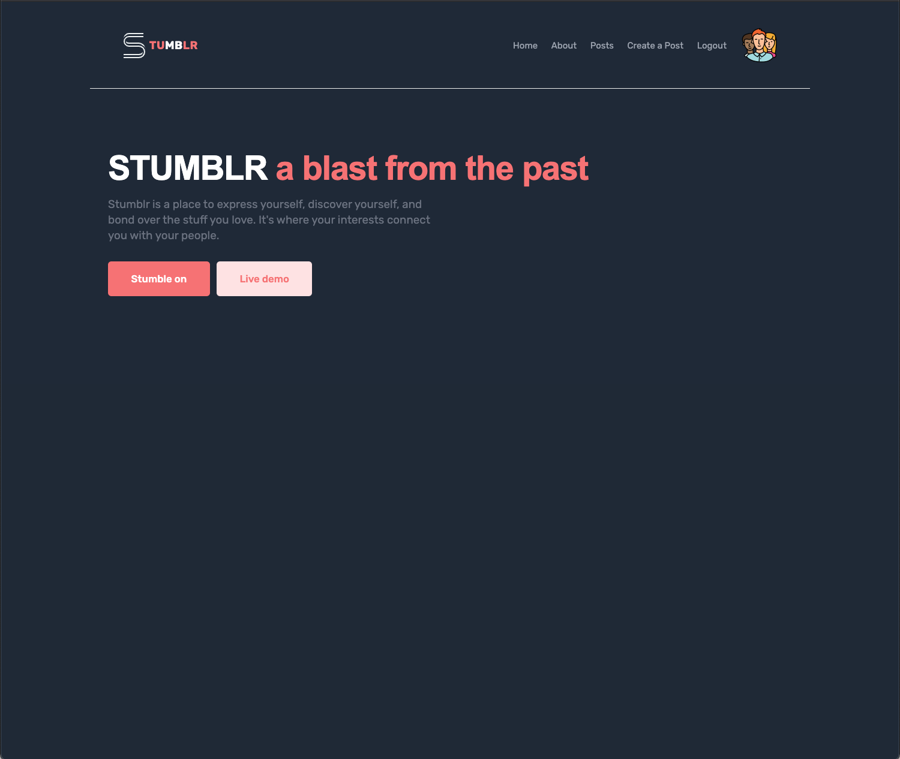
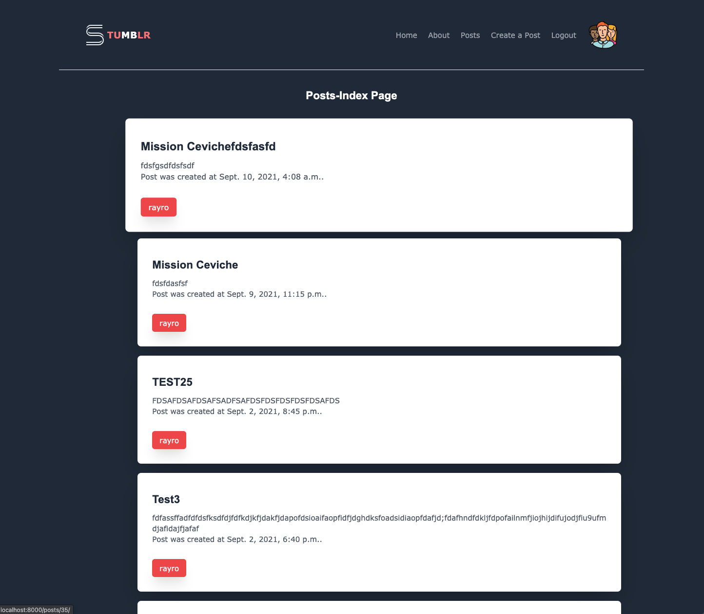
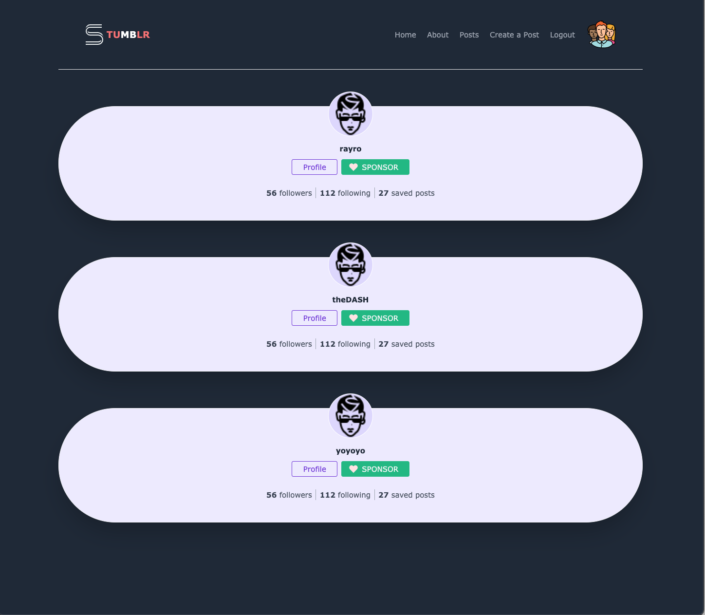

# Stumblr 
## Introduction

Stumblr is a place to express yourself, discover yourself, and bond over the stuff you love. It's where your interests connect you with your people.

## Instructions For Use

- Create an Account. 
- Create a Post. 
- View all posts created. (desc order)
- Comment on post and create a dialogue with your fellow bloggers.   

## Tech Framework
### This app uses:
* [Python](https://www.python.org/)
* [Django](https://www.djangoproject.com/) 
* [Postgresql](https://www.postgresql.org/)
* [TailwindCSS](https://tailwindcss.com/)

  
## This app is hosted at: 
* [GitHub Repo](https://github.com/nrayrod1016/techspace)
* [Heroku Hosted Site](https://stumblrspace.herokuapp.com/)

## Ice Box Goals

* Search for Blogs by name
* Add and Delete a like from a Post 
* Edit and Delete comments 
* Subscribe to a blog 
* Lightmode

## Special Thanks

* Instructors (Ben Manley, Jurgen Stevens, and Brian Krabec) and peers from the General Assembly SEIR-6-21 cohort for collaboration in developing this app.

* The code for this website was written with frequent reference to a number of 3rd party resources:
  * [CSS-Tricks](https://css-tricks.com/)
  * [Git-SCM](https://git-scm.com/docs)
  * [MDN Web Docs](https://developer.mozilla.org/en-US/)
  * [Stack Overflow](https://stackoverflow.com/)

## About the Developers

### Nick Rodriguez

Nick is a full stack web developer from the NYC area, with a passion for food, culture and technology. Nick decided to get into software development after after a 5 years in the Hospitality Management Industry. Learn more about Nick at these links:

* [LinkedIn](https://www.linkedin.com/in/nicholas-r-rodriguez/)
* [GitHub](https://github.com/nrayrod1016)

## Screenshots

[Back to Top](#top)
